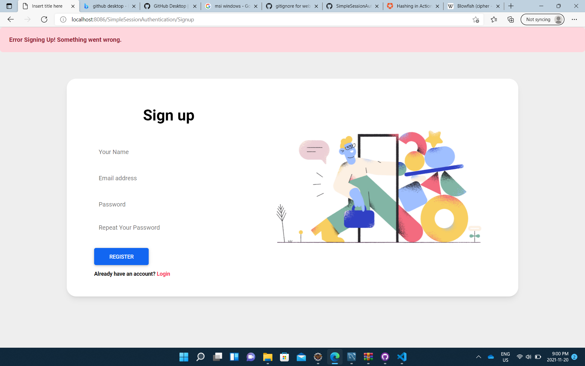
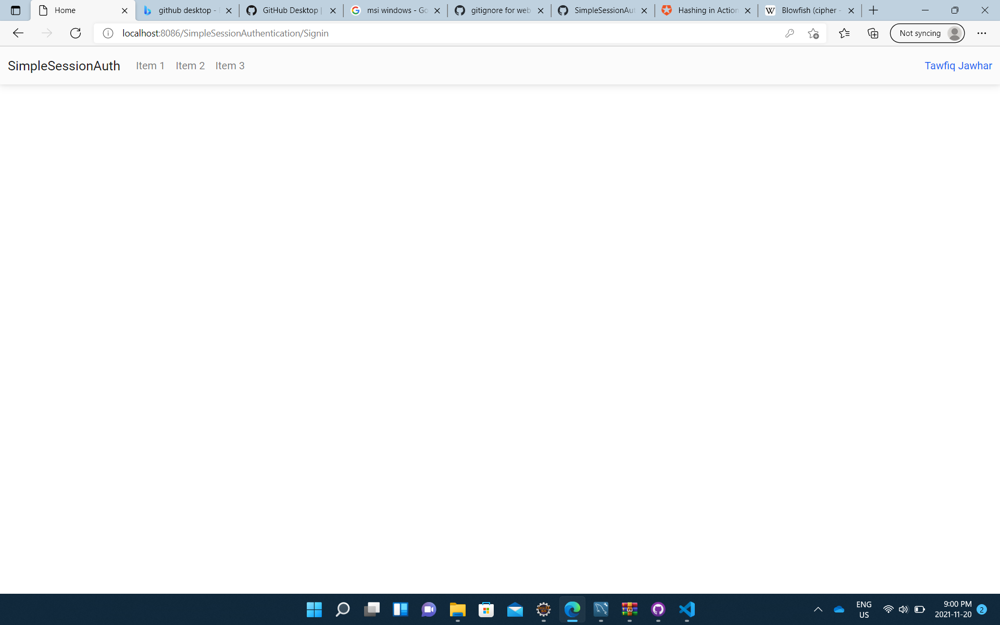

# SimpleSessionAuthJava
 

 This is an example Java web project with simple session based authentication for 420-N34-LA Java Web Programming Course - Champlain College

 ## Recreate MySQL db

 ```SQL
CREATE database SimpleSessionAuthentication;

CREATE USER 'simpleauthenticationuser'@'localhost' IDENTIFIED WITH mysql_native_password
BY 'simpleauthenticationuser';
GRANT ALL PRIVILEGES ON * . * TO 'simpleauthenticationuser'@'localhost';

CREATE TABLE SimpleSessionAuthentication.users (
  `id` int NOT NULL AUTO_INCREMENT,
  `email` varchar(45) NOT NULL UNIQUE,
  `password` varchar(200) NOT NULL,
  `fullname` varchar(45) NOT NULL,
  PRIMARY KEY (`id`)
);
```
## Authentication Overview

### BCrypt
YOU SHOULD NEVER SAVE RAW PASSWORDS IN YOUR DATABASE!

What we can do is encrypt the password in a one way encryption method. 
That way if the database gets stolen or hacked, it will be difficult to find the real passwords of users. 

A popular encryption algorithm used is BCrypt. 
One advantage of BCrypt over other algorithms is that it is slow!
Not slow enough to cause a problem when you are using it in your app. But slow enough for someone to try and encrypt many passwords! 

If a database gets hacked with encrypted passwords, one way to try and find what is the actual password of an encrypted password is to have a very big dictionary of possible passwords, encrypt all of them and check if any of them matches the encrypted password we have in the database. 

Having a slow encryption algorithm can make this more difficult to succeed!

### Cost 
The algorithm has a cost parameter which specifies "how much work" is needed for the encryption to be done. In this application I am using cost=12. 
As the cost increases the time to do the encryption increases exponentially! 

### Signing Up
When a user is signing up, the first step is to verify that the password and the repeated password are equal.
Then the password is hashed using BCrypt hashing and the information are stored in the database. 
We don't need to explicitly check if the email already exist because the email column is `UNIQUE` in the table. So an error will occur. However, right now the app does not tell the user that the email already exist. So that's an improvement you can do. 
Once the signup is successful, the application will dispatch to the signin page with a message saying creating an account was successful.

### Signing In
When the user signs in, we get the user information from the database using the email. And then we verify that the password is the same as the password stored. Of course the password that they write is not hashed (encrypted), so in our case we use the library's verifier to verify that the password results in the same hashed password.

If this is successful, we store in the `session` the user object. And we dispatch to the home page.

### AuthHelper
AuthHelper is a class that has some static functions that helps us with the authentication. 

For BCrypt I am using [bcrypt](https://github.com/patrickfav/bcrypt) open source library. It is a standalone library. 

#### **hashPassword**
This method takes the raw password and returns the hashed password using `bcrypt` library as a String. 

```java
public static String hashPassword(String pass) {
    return BCrypt.withDefaults().hashToString(12, pass.toCharArray());
}
```

#### **verifyPassword**
This method takes the raw password and the hashed password and returns true if the password is the hashed password are verified. 
The verifyer is part of the `bcrypt` library. 

```java
public static boolean verifyPassword(String pass, String hashedPass) {
    BCrypt.Result result = BCrypt.verifyer().verify(pass.toCharArray(), hashedPass);

    return result.verified;// result.verified;
	}
```

#### **Keeping Track of The Logged In User**

Whenever we have a user logged in successfully, we will store the user object in the session. 
These two methods are just used to get and set the user object from the session. If the user does not exist then the value returned will be null. 

```java	
public static User isLoggedIn(HttpSession session) {
    return (User) session.getAttribute("user");
}
public static void saveUserInSession(HttpSession session, User user) {
    session.setAttribute("user", user);
}
```

## Project Summary

### DB connection

In the `META-INF/context.xml` file we define the db connection resource

```
<Resource name="jdbc/simpleauthapp"
	auth="Container" type="javax.sql.DataSource"
		maxTotal="20" maxIdle="5" maxWaitMillis="10000"
		username="simpleauthenticationuser" password="simpleauthenticationuser"
		driverClassName="com.mysql.cj.jdbc.Driver"
		url="jdbc:mysql://localhost:3306/simplesessionauthentication?useSSL=false&amp;serverTimezone=UTC"/>
```

This is using the user we created in the SQL to connect. We granted the user full privileges (not secure but easy for local development).

### DbHelper

The database helper class has two methods.

```java
public boolean insertNewUser(User user, String hashedPass) 
```

We pass the information of the user with a User object and the hashed password. The new user will be stored in the database (assuming everything is good).

```java
public User getUser(String email, String password)
```
This method takes an email and password. Gets the user from the db and compares the password. If the user is found and the password is verified then it returns a User object with the user information. Otherwise it returns null.

Note: in this case getting the user from the database and verifying the password are both happening in this method. It might be a better design to separate the two functionalities depending on your app. 
The reason I did it this way, to not have the hashed password stored in the database leave this method. Notice that the User class does not have a member to store a password even. 

### MVC

The project is using MVC structure. The Servlets act as the controller. All requests come to the servlets. The servlet can:
- Access the model classes `DbHelper`, `AuthHelper`, and `User`. 
- Perform some logic based on data it retrieved from the model, for example check if there isn't a logged in user and redirect to the sign in page. 
- Put data in the request that was retrieved from the model, for example the logged in user object. 
- And it can dispatch to the view, which in our case are the `jsp` files.

### Access Points

There are 4 Servlets. 

- `Home` which has a url pattern of `/index.html`. So if we access the web app at the root URL it will access this servlet. This servlet will check if we have a user stored in the session then it will put the user object in the request and dispatch to the `home.jsp` page. If there isn't a user in the session (user not logged in), it will dispatch to the `signin.jsp` page.

- `Logout` will invalidate the session. `session.invalidate();` meaning, any objects bounded to the session will be cleared. This will clear any user object that we have stored before in the session. After clearing the user from the session, it redirects to the index of the site. Notice there's a difference between dispatching and redirect. Dispatching happens on the server before the response returns to the browser. In redirecting, the redirect happens on the browser side. Which is why we send the redirect on the response object: ` response.sendRedirect("./");`

- `Signin`:
    - If the user is already signed in, redirect the user to the home page.
    - If the signin form was submitted and the user is authenticated successfully, put the user object in the request and dispatch to `home.jsp` else put an error message in the request and dispatch to  `signin.jsp` page.
    - If the signin form was not submitted and the user is not logged in already, just dispatch to the `signin.jsp` page.

- `Signup`:
    - If the user is already signed in, redirect the user to the home page.
    - If the signup form was submitted insert a new user to the db. If the new user is inserted successfylly, dispatch to `signin.jsp` with a message in the request telling the user that their account was created and they can sign in now. If inserting the user caused an error put an error message in the request and dispatch to  `signup.jsp` page.
    - If the signup form was not submitted and the user is not logged in already, just dispatch to the `signup.jsp` page.


### View Frontend 

I am using [mdboostrap](https://mdbootstrap.com/docs/standard/getting-started/installation/) which is material design built using bootstrap 5. I have used multiple page templates from the online documentation. 

#### Forms

The forms for sign in and sign up uses POST method. This is important because the data that the request will have from the form includes the password. You don't want your password to be visible in the url! The action is the servlet name. 

In each form there's a hidden input which I am using to check if the form was submitted. However another way I could have done this is by processing the form in the `doPost` method of the servlet. Right now the `doPost` method basically calls the `doGet`. If the form is processed in the `doPost` it means we don't have to check if a hidden input exist, because the request will be a post only when we submit the form.

#### Message Display

To display a message on the page, I added a simple toast that is displayed if a `message` value exist. 

```html
<c:if test="${not empty message}">
    <div class="alert  fixed-top ${messageClass}" role="alert">
        <strong> ${message} </strong>
    </div>
</c:if>
```

From the servlet, before dispatching to the jsp, you can set the `message` and `messageClass` values:

```java
request.setAttribute("message", "Error signing in!");
request.setAttribute("messageClass", "alert-danger");
```

The message class is css class from bootstrap. I am using `alert-danger` for errors and `alert-success` for successful messages.

### lib

In the `WEB-INF/lib` folder, I have 5 jar files.

For the `bcrypt` library

```
bcrypt-0.9.0.jar
bytes-1.5.0.jar
```

JSTL library (`c:if`)
```
jakarta.servlet.jsp.jstl-1.2.6.jar
jakarta.servlet.jsp.jstl-api-1.2.7.jar
```

MySQL connector
```
mysql-connector-java-8.0.13.jar
```

### Screenshots





